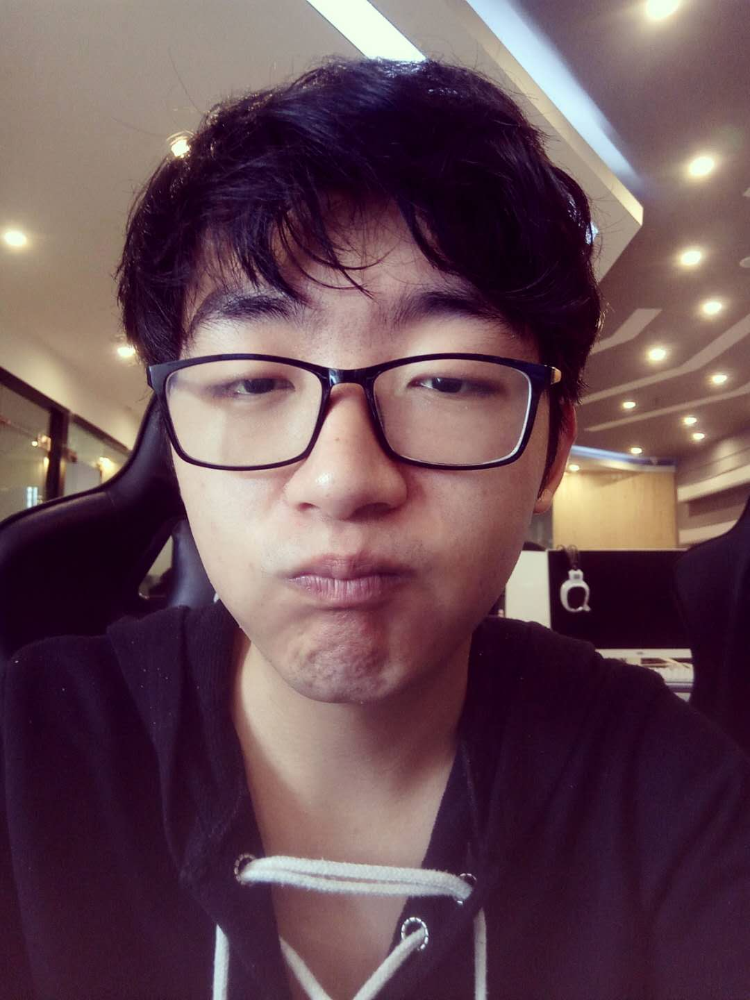
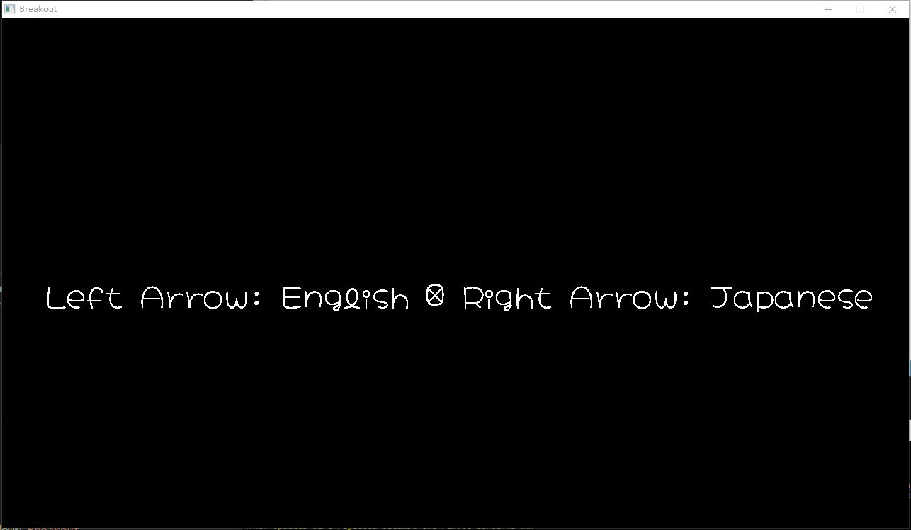
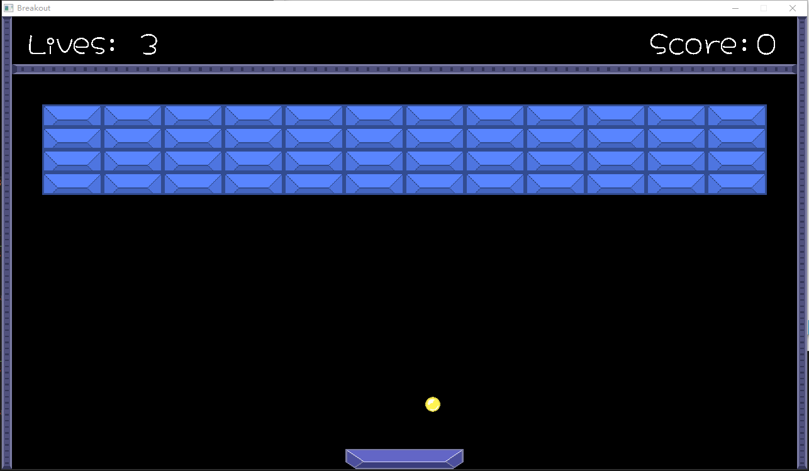
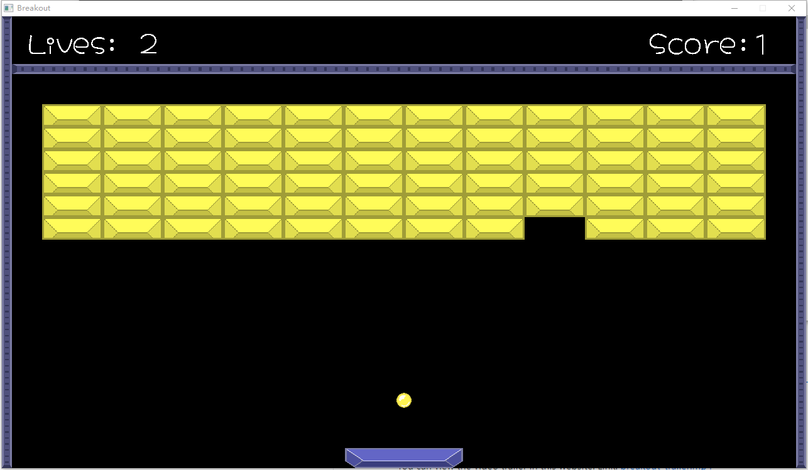
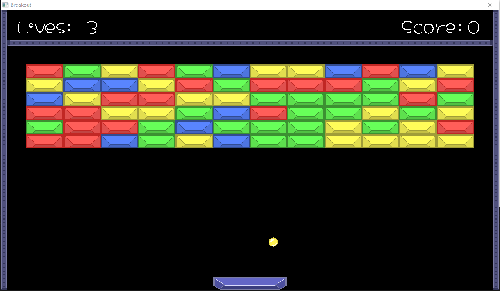
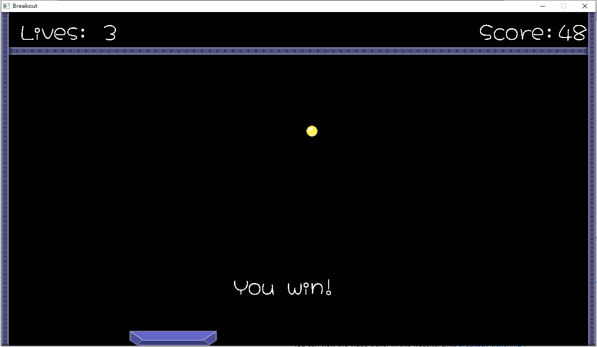
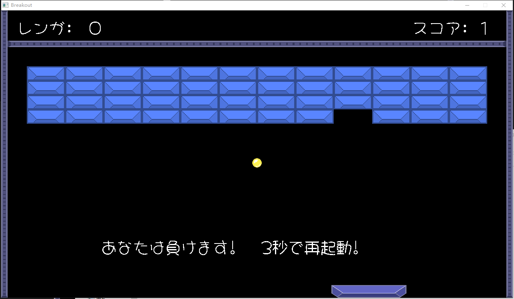

# Personal Information

<table border="0">
  <tr>
    <td width="75%">
      <h1>Hang Zhou</h1>
      
<b>Major : Game Science and Design</b>

      
<b>Email : zhou.han@northeastern.edu</b>

      
<b>Assignment 1: Breakout</b>

    </td>
     <td width="25%">
      
    </td>

  </tr>
</table>

# Build
This game is only available for windows users. If you want to build this game, you have to install **python3**. And then use **mysys** or **command line** and go to the directory **./Game** and execute **python build.py**.

# Play
If you want to play this game, you can double click **breakout.exe** file in the **bin** folder. If you use command line or other similar tools, you should go into the folder **bin** folder and then execute **breakout.exe**.

# Documentation
[Main page](./html/index.html)
# Binary Link
You can download Breakout on Google drive, unzip and run directly on Windows 10 platform if you are have northeastern account. Link: [Breakout.7z](https://drive.google.com/file/d/1hja6T8q5zGLiyiclGFBYEn-Vaj9ENcZa/view?usp=sharing)

Otherwise, you can send an email to me to ask for source code.
# Post Mortem

I can spend 1 week restructuring my code, including use ResourceManager to load all the resources. Which means all the images, music, sound effect and font should be loaded in the ResourceManager, instead of only loading images. In this week I will add more different kinds of resources and then use maps to store them based on the data type. Next, I will spend 2 weeks constructing a complete UI interface, with which the player can pause the game or restart the game at any time. And then use 2 more weeks to make a game screen made of grids and load all bricks into those girds which means the width and height of each brick will be fixed.

So I have 3 weeks left. Next week, in order to decrease the size of the game, I will study how to use asset files to package resource files instead of putting all the .png or .wav files in a separate folder. In the last 2 weeks, I will try to implement a  customization system in which each player or developer can design the levels with a visualization tool. They can delete levels and add levels whenever they want. This tool can modify the initial position of balls and paddles with the mouse, and move bricks at specified grids.

# Video

You can watch the video trailer of Breakout in this website: Link: [breakout_trailer.mp4](https://drive.google.com/file/d/1J2yctzmQSII5dBA7eiaZ-MNhWkmjEiCV/view?usp=sharing)

# Screenshots

